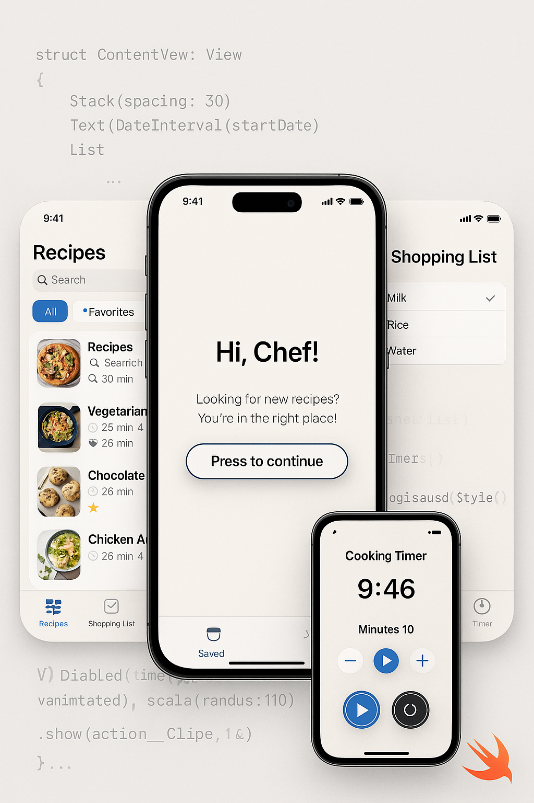
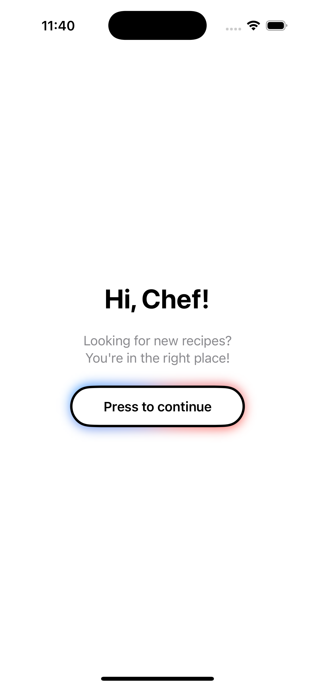
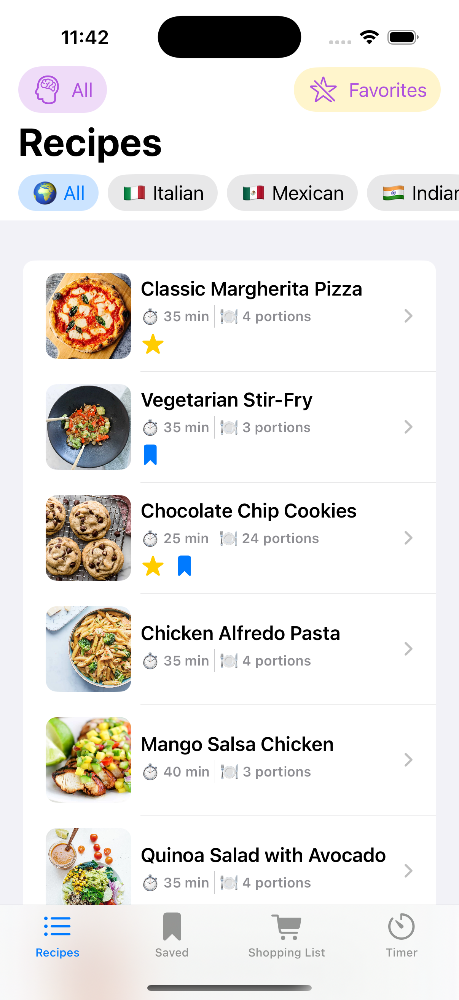
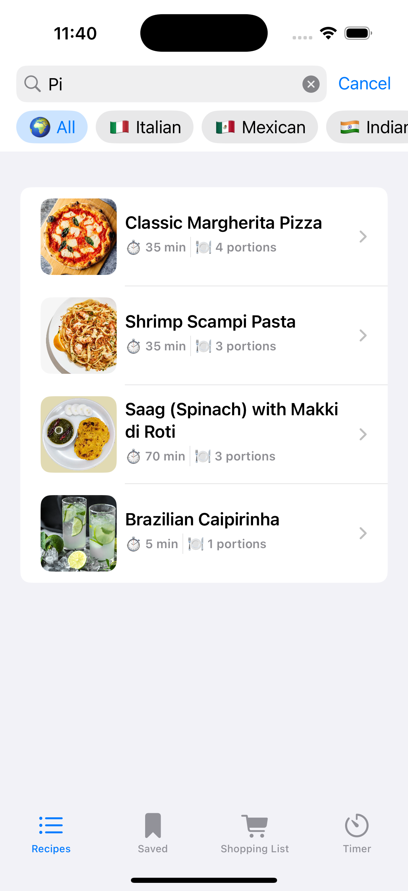
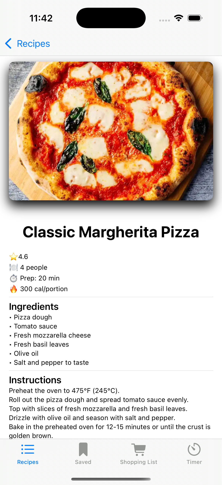
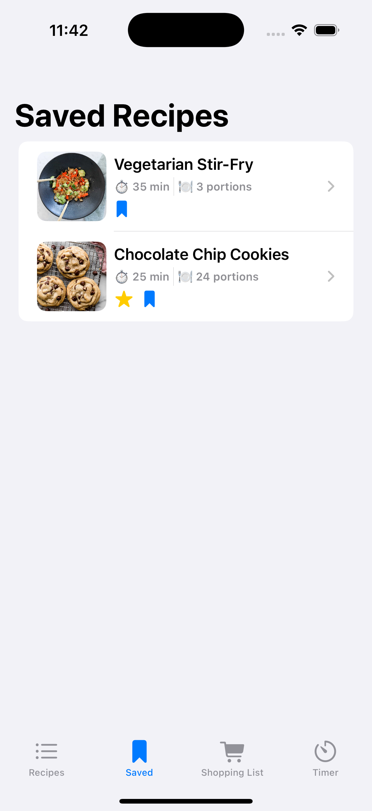
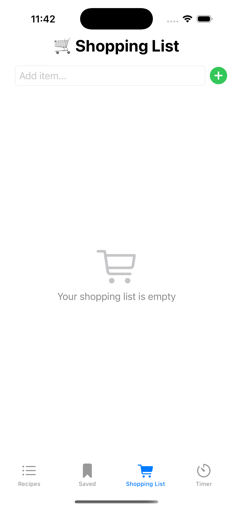
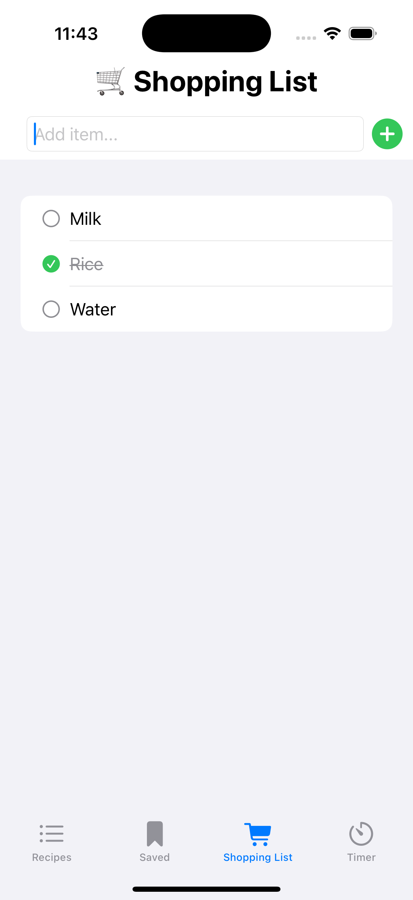
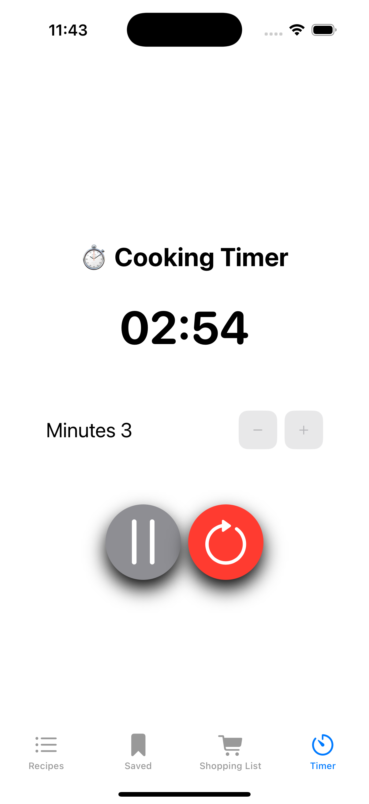

# 🧑‍🍳 RecipesApp

Aplicación iOS desarrollada en SwiftUI que permite gestionar recetas de cocina con múltiples funcionalidades útiles y una interfaz intuitiva.
Esta app fue desarrollada como parte del curso **Swift Developer Program Primavera 2025**, y su objetivo es poner en práctica conceptos como arquitectura MVVM, gestión de estado con `@Observable`, diseño de interfaces reactivas en SwiftUI y buenas prácticas de desarrollo.

  

## 📚 Aprendizajes y retos

Durante el desarrollo de esta aplicación he trabajado con conceptos clave de desarrollo en SwiftUI:

- 💡 Aplicación del patrón **MVVM** para separar lógica de negocio y presentación.
- 🧠 Gestión del estado usando `@Observable`, `@Environment`, `@Binding` y `@StateObject`.
- 📦 Diseño de vistas reutilizables y componentes con `ViewModifier`.
- 🔍 Filtros combinados por país, dificultad, búsqueda y favoritos.
- 🕐 Creación de un **temporizador de cocina** con lógica propia, animaciones y control de ejecución.
- 🛒 Gestión dinámica de una lista de la compra editable y persistente durante la sesión.

Entre los retos más interesantes destacan:

- La sincronización entre vista y lógica del temporizador en tiempo real.
- La creación de botones interactivos que se desactivan cuando el temporizador está en marcha.

Este proyecto me ha permitido reforzar mis habilidades en Swift, SwiftUI y diseño de apps iOS bien estructuradas.

## 🛠 Tecnologías

- SwiftUI
- MVVM
- Property wrappers como `@State`, `@Binding`, `@Environment`, `@Observable`
- Animaciones con `withAnimation`
- Persistencia en memoria
- Patrón composable y componentes reutilizables

## ✨ Funcionalidades principales

- ✅ Lista de recetas con filtros por dificultad, país, favoritos o búsqueda por nombres
- ✅ Detalle de cada receta con imagen, tiempo y porciones
- ✅ Swipe actions para marcar favoritas o guardarlas
- ✅ Temporizador de cocina personalizable
- ✅ Lista de la compra editable

## 📱 Capturas

  
  

  
  
  

  
  
  

  

## 🚀 Cómo usar
1. Clona este repositorio:
2. Abre el archivo RecipesApp.xcodeproj en Xcode
3. Ejecuta la app en el simulador o en un dispositivo físico.

## 📌 Futuras mejoras
	•	Guardado persistente de recetas favoritas
	•	Exportar lista de la compra
	•	Añadir más idiomas
	•	Integrar notificaciones al finalizar el temporizador

Desarrollado por Antonio Hernández Barbadilla  
Curso Apple Coding Academy · Primavera 2025
 
