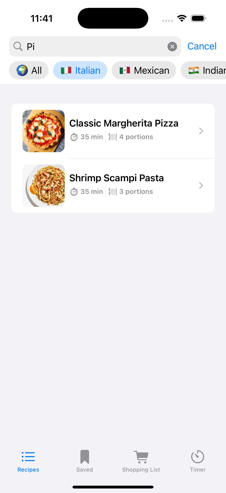

# 🧑‍🍳 RecipesApp

Aplicación iOS desarrollada en SwiftUI que permite gestionar recetas de cocina con múltiples funcionalidades útiles y una interfaz intuitiva.

  

## 🛠 Tecnologías

- SwiftUI
- MVVM
- Property wrappers como `@State`, `@Binding`, `@Environment`, `@Observable`
- Animaciones con `withAnimation`
- Persistencia en memoria
- Patrón composable y componentes reutilizables

## ✨ Funcionalidades principales

- ✅ Lista de recetas con filtros por dificultad, país, favoritos o búsqueda por nombres
- ✅ Detalle de cada receta con imagen, tiempo y porciones
- ✅ Swipe actions para marcar favoritas o guardarlas
- ✅ Temporizador de cocina personalizable
- ✅ Lista de la compra editable

## 📱 Capturas

### Bienvenida

  

### Lista de recetas con filtros

  

### Filtro por país

  

### Filtro por búsqueda

  

### Detalle de receta

  

### Guardadas

  

### Lista de la compra

  

### Lista de la compra vacía

  

### Temporizador de cocina

  

## 🚀 Cómo usar
1. Clona este repositorio:
2. Abre el archivo RecipesApp.xcodeproj en Xcode
3. Ejecuta la app en el simulador o en un dispositivo físico.

## 📌 Futuras mejoras
	•	Guardado persistente de recetas favoritas
	•	Exportar lista de la compra
	•	Añadir más idiomas
	•	Integrar notificaciones al finalizar el temporizador

Desarrollado con ❤️ por Antonio Hernández Barbadilla  
Curso Apple Coding Academy · Primavera 2025
 
